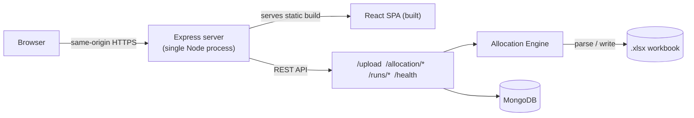

# Vector — Production Planning & Scheduling

Manufacturing planners were allocating weekly parts demand across production
lines by hand in Excel — a process that had to respect per-line capacity,
borrow capacity between lines when one was full, and stay correct across
hundreds of parts, with no way to verify a plan was actually executable before
committing to it. **Vector** takes that same Excel workbook, runs a
deterministic, capacity-aware allocation engine against it, and returns an
updated workbook plus a web dashboard showing exactly what was scheduled,
where, and what couldn't be. The core engineering challenge is producing a
schedule that is not just plausible but **physically executable** — never
committing more work to a line-day than it can actually run — and proving
that with tests rather than assuming it.

**Live Demo:** _deployed on Render — https://vector-update-403i.onrender.com/
**Repository:** [github.com/vijaykrishna68/Vector_UPDATE](https://github.com/vijaykrishna68/Vector_UPDATE)

---

## Problem

Planning started, and largely still starts elsewhere, as a spreadsheet: a
planner receives weekly demand for hundreds of parts, each with an assigned
production line and a cycle time (minutes per unit). The workbook's own
structure — which columns hold which week's demand, which sheet tracks
working days, which cell ranges are safe to write — encodes business logic
and operational assumptions that aren't visible from the numbers alone.

Three things make this genuinely hard to automate correctly, not just
tedious to do by hand:

- **Capacity is a hard constraint, not a suggestion.** Four production lines
  have different daily capacities, and some lines can absorb overflow from
  others — but only in a defined order, and only up to their own limit.
- **The allocation has to be deterministic and explainable.** A planner
  reviewing a generated schedule needs to trust it was produced by the same
  rules every time, not a black box that might allocate differently on a
  re-run of the same input.
- **A wrong allocation isn't just inconvenient — it's not executable.** If
  the logic double-books a line-day, the resulting "plan" describes more work
  than the factory can physically perform. Vector's engineering history
  includes exactly this failure mode (see [Engineering
  Challenges](#engineering-challenges)), which is why correctness here is
  treated as a first-class concern, not a detail.

---

## Solution

Vector turns that spreadsheet-driven process into a repeatable pipeline:

1. **Upload** the planner's `.xlsx` workbook through the web interface.
2. **Validate and parse** it — file type, size, and structure are checked
   before any data is trusted; the schedule sheet and working-days sheet are
   identified from the workbook's own structure rather than assumed by
   position.
3. **Normalize demand** — duplicate rows for the same part and week are
   merged, invalid rows (missing spec, non-positive cycle time) are excluded
   and reported rather than silently dropped.
4. **Run deterministic allocation** against the four production lines,
   respecting capacity, priority order, and fallback rules.
5. **Enforce capacity and date constraints** throughout — no line-day is ever
   allocated more work than it can execute, and demand that can't fit its
   planned window is extended into later dates rather than lost.
6. **Persist the run** — the resulting schedule, per-line totals, and any
   diagnostics are stored so it can be reviewed later, not just returned once.
7. **Expose the result** through a dashboard, a per-week schedule view, and a
   downloadable updated workbook.

---

## Key Engineering Highlights

- **Deterministic allocation engine** — the same input workbook always
  produces the same schedule; no randomness, no allocation-order dependence.
- **Capacity-aware scheduling** — every allocation is bounded by
  `floor(remaining capacity minutes / cycle time)`; a line-day's capacity is
  never exceeded.
- **Excel/XLSX processing** — the same `.xlsx` structure planners already use
  is parsed, updated, and returned, including a rewritten working-days sheet
  and per-part daily allocations.
- **Golden-master regression testing** — allocation output is compared
  against stable, sorted-key JSON snapshots, so any behavioral change to the
  engine produces a loud, reviewable test failure instead of a silent
  regression.
- **Defensive workbook validation** — uploads are checked by extension, MIME
  type, and magic bytes before parsing, and the working-days sheet is
  identified by a header label the workbook itself declares; if that
  identification is ever ambiguous, the engine **throws rather than
  guessing**, because writing to the wrong sheet would silently corrupt
  planner data.
- **Production deployment** — running as a single Node/Express service on
  Render, serving both the API and the built frontend from one origin.
- **Same-origin full-stack architecture** — the frontend makes only
  same-origin relative requests in production, so no cross-origin
  configuration is required between the API and the UI.
- **Measured performance fix, precisely scoped:** the workbook-serialization
  path improved from **~75.6 seconds to ~0.54 seconds (~141×)**, with
  **byte-identical output verified across 315,070 cells**. This measurement
  applies specifically to a workbook-metadata defect in the XLSX write path
  (see [Engineering Challenges](#engineering-challenges)) — it is not a claim
  about overall application performance.

---

## Architecture

### Frontend
React 19 with Vite 7 and Tailwind CSS v4 (CSS-first `@theme`, no separate
config file). Routing is a small hand-rolled History-API router rather than a
routing library — chosen so the client route `/history` wouldn't collide with
the real API route `GET /runs`. One shared component module supplies every
page's cards, buttons, status badges, and table primitives, so visual and
interaction behavior stays consistent across the app rather than being
redefined per screen. Status meaning (label, symbol, color) is derived
entirely from what the backend reports — color is never the only signal.

### Backend
Node.js with Express 5, structured as `routes → controllers → services →
models` rather than logic embedded in route handlers. The Express app is
built by a factory function specifically so the test suite can exercise the
real app — real middleware, real routes, real error handling — without
opening a network port. Errors always resolve to a consistent
`{ error, code, requestId }` JSON shape. `helmet` supplies a Content-Security-
Policy, CORS fails closed to same-origin when no explicit allowlist is
configured, and upload requests are rate-limited.

### Database
MongoDB via Mongoose. A planning run and its results are written in two
phases — created as `pending` (invisible to readers), then promoted to
`complete` only once every child record is written — so a run that fails
partway through can never be mistaken for a usable one. This exists because
the code verified directly that a standalone MongoDB deployment rejects
multi-document transactions; the two-phase flag is the guarantee that works
on any topology, with a transaction used additionally where one is supported.

### Excel Processing
`xlsx` (SheetJS) handles both parsing and writing. The schedule sheet is
identified by the presence of specific header cells; the working-days sheet
is identified by a label the workbook itself declares, not by position or
sheet order — an earlier, looser heuristic silently picked the wrong sheet on
real data (see [Engineering Challenges](#engineering-challenges)). Before
writing, a workbook's declared cell range is recomputed from its actual
populated extent, which is also what the ~141× write-time fix depended on.

### Production
The deployed architecture is a **single Node/Express service** that serves
both the REST API and the built React application from one origin, backed by
MongoDB. There is no separate frontend host, reverse proxy, or CDN in this
setup — the same process that answers `/allocation/weeks` also serves
`index.html` for every other route.

---

## Allocation Engine

The engine allocates demand for **four production lines** with fixed daily
capacities (workers × 475 minutes/worker), across three weekly demand buckets
read from the workbook's `BU`, `BV`, and `BW` columns, writing results into
the workbook's `CU`-onward date columns.

**Confirmed business rules** (verified against the workbook and the planning
process, not assumptions):
- `BU`/`BV`/`BW` are **demand buckets**, not independent production windows —
  total demand for a part is `BU + BV + BW`, spread across one shared
  production calendar starting at `CU`.
- Buckets are processed in a fixed order, `BU → BV → BW`, sharing **one
  capacity model and one date cursor** — a day's capacity is opened once, by
  whichever bucket reaches it first, and consumed minutes persist across all
  three buckets. Each bucket resumes exactly where the previous one left off.
- Lines are attempted in a fixed **priority order, `3 → 2 → 4 → 1`**, and a
  line that's full can fall back to another line via a fixed chain
  (`2 → [2, 4]`, `4 → [4, 1]`, `3` and `1` have no fallback) — quantity
  produced on a fallback line is still attributed back to the part's original
  line for reporting.
- A bucket that can't fit its full quantity in its planned window **spills
  forward** into later date columns, up to a small per-line tolerance, rather
  than being silently truncated.

**Why determinism matters here specifically:** the same workbook run twice
must produce the same schedule, both so a planner can trust the output and so
the engine's own regression tests (golden-master comparisons) mean anything
at all. There's no random tie-breaking and no dependence on object-iteration
order for the result.

**Infeasibility handling:** demand that still can't be placed after
scheduling and tolerance-driven extension is reported as unallocated per
part, not hidden or force-fit. Weeks where total demand minutes exceed the
capacity minutes counted for that week are flagged as overloaded.

**What this is not:** a solver for a globally optimal schedule. It's a
deterministic, priority-ordered, capacity-bounded heuristic — it guarantees
no line-day is ever overcommitted, not that the resulting plan minimizes
overload or maximizes throughput in any formal sense. The exact capacity
basis for one of its own diagnostics (`OVERLOAD`) is itself an
explicitly-acknowledged open question — see [Known
Limitations](#known-limitations).

---

## Engineering Challenges

### 1. Shared-capacity scheduling bug
An earlier version of the engine allocated each of the three demand buckets
against a **freshly reset** capacity model, all starting at the same first
date column. On a real workbook, this meant three weeks' worth of quantities
landed in the same cells and were summed together — producing a schedule that
committed **more work to a day than the entire factory could physically run**
(one day was over capacity by nearly a full extra day's output).

The fix wasn't written until the bug was proven concretely: a worked example
from a real workbook, cell by cell, showing the impossible totals. The
underlying evidence for *intended* behavior — an unused function parameter
whose name and value matched exactly what a running date offset would need,
and calendar-distinct week labels already present in the sheet — was found in
the code itself before any line was changed. The fix then moved all three
buckets onto one shared capacity model and one shared date cursor, with every
other business rule (priority order, fallback chains, capacity constants,
tolerance) left byte-identical, confirmed by the golden-master tests.

**The engineering principle: prove the bug before changing the business
rule.** One genuinely ambiguous question — exactly which date each bucket
should start on when a prior bucket overruns its planned window — was
deliberately left as an open business decision rather than guessed at.

### 2. Workbook safety / incorrect sheet selection
The "working days" summary sheet was originally selected by scanning for the
first non-schedule sheet containing three specific cells. On a real 30-sheet
production workbook, **17 sheets matched that heuristic**, so it silently
selected a pivot-table output area and overwrote three of the planner's cells
on every run — a real, observed instance of picking the wrong worksheet
entirely.

The fix identifies the sheet by a header label the workbook itself declares,
and — critically — **throws rather than guessing** if that label isn't found
on exactly one sheet. A heuristic that can silently pick the wrong target and
then *write* to it is more dangerous than one that fails loudly: a thrown
error is recoverable, silent data corruption in a planner's workbook is not.

### 3. XLSX performance
Writing the output workbook took roughly 75 seconds. The cause wasn't the
allocation algorithm — it was that real planner workbooks declare a sheet
range spanning the full ~1,048,576-row Excel limit, so every write serialized
nearly a million empty rows. Recomputing the sheet's true populated extent
from its actual cell keys before writing brought this down to **~0.54
seconds (~141×)**, verified **byte-identical across all 315,070 cells** of
the original output. This is a fix to file-format metadata handling, not to
the allocation logic — and the number above describes that specific write
path, not the application as a whole.

### 4. Deployment debugging
A Render deployment build failed with `Cannot find package
'@vitejs/plugin-react'`, imported directly by the committed `vite.config.js`
— even though the identical build succeeded locally every time. The cause:
Render's build sets `NODE_ENV=production`, under which `npm install` omits
`devDependencies` entirely, and that package was listed there. The failure
was **reproduced locally first**, deliberately, with a production-mode clean
install, before any fix was written. The dependency was reclassified from
`devDependencies` to `dependencies` — the one package the reproduction
actually proved was missing — and the same reproduction was re-run to confirm
the fix before the deployment was retried.

---

## Testing & Reliability

Vector's test suite (Node's built-in `node:test` — no external test-framework
dependency) covers the allocation engine, workbook parsing, API contracts,
and run persistence, and includes:

- **Characterization tests** for bugs found during development — each one
  asserts the *actual current* behavior (including known bugs) on purpose,
  so that fixing the underlying issue produces a deliberate, reviewable test
  failure instead of an unnoticed behavior change.
- **Golden-master fixtures** — allocation output compared against
  stable, key-sorted JSON snapshots; a mismatch means engine behavior
  changed, and snapshots are only ever updated deliberately, never as a side
  effect of a failing run.
- **Regression tests** validating that fixed bugs stay fixed.
- **Deterministic output** as a testable property in its own right — the
  same synthetic and real workbooks are expected to produce byte-identical
  results run after run.
- **API and integration tests** exercising the real Express app (via the
  same app factory used in production) and, where a MongoDB instance is
  reachable, real persistence behavior.
- **Frontend lint and build verification** as part of the same discipline —
  the UI is checked, not just the engine.

**The governing philosophy: existing behavior was characterized before it
was changed.** When a known-bug characterization test's underlying bug is
deliberately fixed, the test is **inverted to assert the corrected behavior,
not deleted** — the historical bug stays documented in the test suite even
after it no longer reproduces.

Note on environment: MongoDB-dependent test suites are designed to skip
cleanly (not fail) when no test database is reachable, and the real-workbook
validation suite similarly skips when no sample workbooks are present
locally — the core allocation and API-contract tests do not depend on either.

---

## Interface

The frontend's visual language was a deliberate design choice, not a default
theme: a warm ivory/paper background and graphite typography instead of a
stark-white admin-dashboard look, a restrained industrial-orange accent used
only for primary actions and selection state, and muted teal for healthy
operational status — never more color than the interface needs to
communicate. Numeric and technical values (quantities, capacity, timestamps,
run IDs) are set in **IBM Plex Mono**, deliberately distinct from **Inter**,
which carries interface text — so technical data is visually identifiable at
a glance, not just formatted the same as everything else. Borders and
whitespace are used sparingly and only where they mark a real boundary,
rather than wrapping every element in a card.

---

## Deployment

Vector is deployed as a **single Node/Express service on Render**: the same
process serves the built React application and the JSON API from one origin,
backed by an external **MongoDB** instance reachable via `MONGODB_URI`. A
root-level `package.json` drives the production build — installing and
building the frontend, then installing the backend's dependencies, so
`client/scheduler-fe/dist/` exists before the server starts — and `npm start`
runs the Express server with its working directory preserved so its own
environment loading behaves the same in production as in local development.

Configuration is environment-variable driven (`server/.env.example`
documents each one — `MONGODB_URI`, `PORT`, `NODE_ENV`, `CORS_ORIGINS`,
upload-size and rate-limit settings — with safe placeholder values only; no
real values are committed to this repository).

---

## Known Limitations

- **The allocation engine is a heuristic, not a solver** — it guarantees no
  line-day is ever overcommitted, but does not claim to produce a globally
  optimal schedule in any formal sense.
- **One diagnostic's exact definition remains an open question.** The
  `OVERLOAD` metric's capacity basis (which days and lines count toward it)
  is explicitly acknowledged as ambiguous and is pinned by a characterization
  test rather than resolved by guessing at intent.
- **Tolerance behavior at bucket boundaries is a pending business decision**,
  not a defect: a small amount of demand (within a configured tolerance) can
  remain stranded at a `BU→BV→BW` boundary even when later capacity exists,
  and whether that should change is a planner decision, not an engineering
  one.
- **The `xlsx` (SheetJS) dependency has known vulnerabilities with no fix
  currently available on the npm registry.** This is a documented, accepted
  risk rather than an unknown gap — upload validation (extension, MIME type,
  magic bytes, size limits) is the mitigating control in place today.
- **No continuous integration is configured.** Tests are run manually.
- **Test counts vary by environment** — MongoDB-dependent suites skip
  cleanly rather than run when no test database is reachable, so the total
  number of executed tests depends on what's available locally.

---

## Tech Stack

| Category | Technologies |
|---|---|
| **Frontend** | React 19, Vite 7, Tailwind CSS v4, Lucide (icons), self-hosted Inter & IBM Plex Mono (`@fontsource`) |
| **Backend** | Node.js, Express 5 |
| **Data** | MongoDB (Mongoose) |
| **Planning / File Processing** | `xlsx` (SheetJS) |
| **Testing** | Node.js built-in test runner (`node:test`) |
| **Deployment** | Render — single Node/Express service, root-level `npm install` / `npm start` |

---

## Project Status

Vector is **deployed and functional**, running as a single Node/Express
service backed by MongoDB. The core workflow — upload, validation,
deterministic allocation, persistence, and the dashboard/schedule/run-history
views — is implemented end to end and has been exercised against real
production planning workbooks during development.
